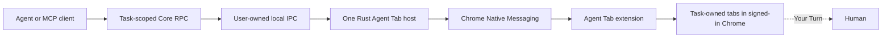

# Agent Tab

**Any agent. Your browser. Your rules.**

**Local browser runtime for AI agents**

> Give an agent a tab, not the keys to your browser.

Agent Tab lets an agent work in your existing signed-in Chrome profile without giving it unrestricted control of the profile. Each connection receives a task-owned browser workspace. The agent can create tabs, inspect and act in those tabs, wait for page state, and ask for help. Passwords, passkeys, 2FA, CAPTCHA, payment secrets, and other human-only input belong to **Your Turn**. Recognizable consequential actions are staged for **Commit** instead of being performed immediately.

## Release status

Agent Tab v2 is **unreleased**. The local source version is `2.0.0-rc.1`; it is not a public npm package, Chrome Web Store item, hosted site, or published release artifact. **Chrome Bridge v1.0.1 remains the available stable legacy path** until the v2 launch cutover.

Do not expect `npx agenttab install` to work today. Stable v2 remains blocked on signing, package-registry, Chrome Web Store, controlled-domain, and platform release gates. The command below is the intended public install flow only after those dependencies are live:

```text
npx agenttab install
```

The command has no path, token, or shell-specific argument and is suitable for POSIX shells, PowerShell, and `cmd.exe` once the package is published. Current source and prerelease setup are documented in [Setup](docs/setup.md).

## A task-owned workflow

1. An agent calls `browser_open` with `mode: "create"`. Agent Tab creates a background tab for that task and returns its task, tab, window, and page-revision identifiers. `placement: "new_window"` may create the task's first tab in a separate unfocused normal window.
2. The agent calls `browser_snapshot`, works from revisioned accessibility references, then calls `browser_act` with the expected page revision. It cannot act on unrelated tabs.
3. If a site requires human-only input, the agent calls `browser_handoff`. Agent Tab focuses that tab, pauses automation, and blocks browser observation until the declared completion condition or **I'm done**.
4. If Agent Tab recognizes a send, publish, purchase, delete, upload, authorization, or permission-grant control, `browser_act` can return `commit_required`. The extension shows the staged effect in its popup. A human must approve it there before the agent can call `browser_commit` with the one-use staged token.
5. The task can list only its own tabs with `browser_tabs`. A separate client gets a separate task unless it proves its durable resume capability.

Commit is a two-party, best-effort semantic barrier, not proof that a page has no external effect. The popup records the human approval, while only the agent's later `browser_commit` can execute the staged action. Page content is untrusted data and a page can attach an effect to an innocently labelled control. Inspect the page and staged action before approving or committing.

## Trust contract

- **Task ownership is an execution and coordination boundary, not profile isolation.** Agent Tab can use the signed-in session in the browser profile, but Standard mode does not expose raw cookies, storage, passwords, arbitrary JavaScript, raw CDP, coordinate actions, network interception, or a generic browser-global mutation API. Its one window-level operation creates an unfocused normal window for the first tab of an otherwise empty task.
- **Your Turn is the only routine focus transition.** Routine task work stays in task-owned tabs. During handoff, all agent observation and capture are denied so human credentials are not captured.
- **Commit requires human approval and agent intent.** A staged action is bound to its task, tab, page revision, element fingerprint, effect, and short expiry. Popup approval records consent but does not execute it. The agent must then call `browser_commit`; a changed page, expired stage, used token, or unapproved stage cannot execute.
- **Local by default.** Policy, task state, audit records, and IPC stay on the machine. Agent Tab has no telemetry. See [Telemetry](docs/telemetry.md) and [Security](docs/security.md).

## Tool surface

Standard mode exposes exactly seven MCP tools:

| Tool | Purpose |
|---|---|
| `browser_open` | Create a task tab, create an unfocused window for a new task, or explicitly adopt the active tab. |
| `browser_snapshot` | Read an accessibility tree, bounded text or HTML, or a screenshot from a task tab. |
| `browser_act` | Run typed actions against one task tab and expected page revision. |
| `browser_wait` | Wait for load, URL, text, selector, network-idle, or download conditions. |
| `browser_tabs` | List only tabs owned by the current task. |
| `browser_handoff` | Give the user control for human-only input. |
| `browser_commit` | Execute one staged consequential action. |

Developer mode adds one tool, `browser_developer`. It is absent from Standard discovery. It requires both the persistent Developer mode control in the Agent Tab popup and `AGENTTAB_DEVELOPER=1` in the adapter environment. Treat it as an explicit expansion of the normal boundary.

The exact schemas, return semantics, and stdio configuration are in [MCP](docs/mcp.md). The source contract is in [Core RPC schemas](schemas/rpc/v1) and the [runtime ADR](docs/adr/0001-agenttab-runtime.md).

## Setup after v2 becomes available

The installer verifies one immutable versioned artifact, registers the native host, and updates supported local client configuration transactionally. It does **not** silently remove Chrome Bridge v1. For a prerelease source build, the extension remains an explicitly loaded unpacked development extension. See [Setup](docs/setup.md) for the current source path, future RC and stable flows, permissions, side-by-side migration, rollback limits, and platform state.

For a configured local installation, an MCP client starts the adapter with:

```text
agenttab mcp
```

The installer writes this as an absolute local command in supported client configuration. For manual configuration, use `agenttab mcp` only when the installed `agenttab` command is on that client's `PATH`. Do not add a TCP port, bearer token, Python host, or manual native-host JSON for Standard mode.

## Architecture



The extension maintains the Native Messaging relationship with the one Rust host. Local adapters use per-user IPC: a user-owned Unix socket on macOS and Linux, or a current-user named pipe on Windows. Standard mode has no port, bearer token, or manual JSON protocol. The separate `agenttab proxy` command is an advanced, loopback-only bridge that deliberately requires a local token file. It is not part of normal setup. [Commands](docs/commands.md) documents its limits.

## Supported-platform state

The source maps host artifacts for macOS on Apple Silicon and Intel, Linux on ARM64 and x86_64, and Windows on ARM64 and x86_64. No signed public v2 artifact matrix is available yet, so none of these are currently offered as a public v2 installation. The extension manifest requires Chrome 127 or later. See [Setup](docs/setup.md#supported-platform-state).

## Repository layout

| Path | Purpose |
|---|---|
| `packages/extension/` | Canonical browser-extension source, tests, and generated `dist/` output |
| `packages/installer/` | Cross-platform installer and local client configuration |
| `packages/mcp/`, `packages/omp/` | Agent adapters and tool rendering |
| `packages/sdk-python/`, `packages/sdk-typescript/` | Client SDKs |
| `host-rs/` | Rust native host and protocol crates |
| `schemas/` | Versioned native and Core RPC contracts |
| `config/` | Frozen product, migration, and release identity |
| `tests/architecture/` | Cross-component safety and architecture gates |
| `scripts/` | Build, packaging, and release verification utilities |
| `docs/` | Setup, security, API, architecture, and launch documentation |

Generated extension assets live only in `packages/extension/dist/`; they are not committed or mirrored into the repository root.

## Migration and documentation

- [Migrate from Chrome Bridge v1.0.1](docs/setup.md#migration-from-chrome-bridge-v101)
- [Setup and local paths](docs/setup.md)
- [Command reference](docs/commands.md)
- [MCP adapter and Core RPC](docs/mcp.md)
- [Security and trust boundary](docs/security.md)
- [Multi-agent behavior](docs/multi-agent.md)
- [Runtime architecture decision](docs/adr/0001-agenttab-runtime.md)

## License

[MIT](LICENSE)
