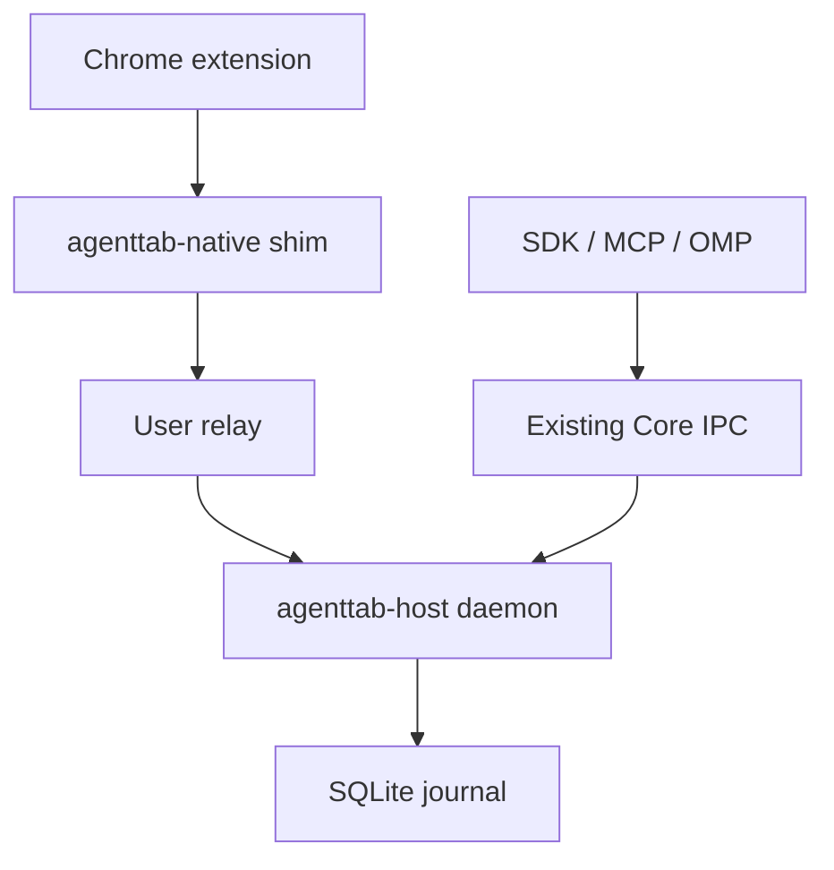

# ADR 0002: Persistent Core daemon and Native Messaging relay

- Status: Proposed
- Date: 2026-08-31

## Context

Chrome owns the lifetime of a Native Messaging process. Manifest V3 may suspend the extension service worker, a native port may be replaced during extension reload, and Chrome exits the native process when the port closes. AgentTab currently combines the Native Messaging endpoint and Core IPC server in `agenttab-host`, so any of those browser events also tears down Core client connections, the SQLite runtime, and in-flight scheduling.

The desired product behavior is the opposite: browser reconnection should be routine transport churn, not a Core restart, and unattended agents should not require a user to notice or approve a prompt. The existing user-scoped Core socket/named pipe, journal, ownership rules, and wide automation surface remain unchanged.

## Decision

AgentTab will ship two Rust executables:

- `agenttab-host daemon` is one long-lived, per-user Core process. It opens the journal and existing Core IPC endpoint once, and separately accepts extension relay connections.
- `agenttab-native` is the executable registered with Chrome. It only connects byte streams: Chrome's framed stdin/stdout to the daemon's user-scoped relay. If the relay is unavailable, it starts the sibling daemon and retries for a bounded four seconds.

`agenttab-host` with no arguments retains the combined stdio plus Core IPC behavior for source builds, compatibility tests, and recovery. Installed Native Messaging manifests point to `agenttab-native`.

The daemon accepts one Native Messaging relay at a time. Every accepted connection receives a monotonically increasing in-process generation. Ready messages, event acknowledgements, commands, disconnect cleanup, and pending-response failure are scoped to that generation, so cleanup from an old Chrome port cannot detach or write into a newer port. A normal EOF moves the runtime to `reconciling` and leaves Core alive. A malformed or incompatible native protocol is terminal and exits the daemon so its user service can restart a clean process.

The relay uses the same trust boundary as Core IPC:

| Platform | Core IPC | Native relay | Persistent startup |
| --- | --- | --- | --- |
| macOS | private Unix socket | separate mode-`0600` Unix socket with same-UID peer check | per-user LaunchAgent with `RunAtLoad` and `KeepAlive` |
| Linux | private Unix socket | separate mode-`0600` Unix socket with same-UID peer check | `systemd --user` service with restart-on-failure |
| Windows | SID-scoped named pipe | separate SID-scoped named pipe with process-token SID verification | current-user, limited scheduled task at logon |

No administrator elevation, new consent dialog, or per-operation approval is introduced. The relay is transport only; it does not add an authorization boundary or narrow existing browser capabilities.

## Installation and upgrades

Release archives contain both signed executables. The installer validates that the archive contains exactly those two regular files, verifies both platform signatures where applicable, and installs them transactionally under the same version and target directory. A mode-`0600` `agenttab-runtime.json` beside the executables carries the absolute state directory so custom installs work even though Native Messaging manifests cannot declare environment variables.

For a stable install, the installer writes the user service definition and activates or restarts it after the file transaction. Service activation is deliberately best effort: if the user's service manager is unavailable, installation remains usable because the native shim starts the daemon on demand. Development installs use on-demand startup and do not modify the user's login services. Updating the platform service points it at the newly installed version before restarting it.

Release packaging signs and verifies `agenttab-host` and `agenttab-native` independently on macOS and Windows, then puts both into the deterministic host archive. Linux continues to authenticate the exact two-file archive through the signed artifact manifest.

## Consequences

- Chrome service-worker suspension, extension reload, and native-port replacement no longer close Core clients or reopen the journal.
- The first browser connection after a missing/crashed daemon may take up to four seconds to establish. Subsequent connections only pay a local IPC connect.
- Core remains in `reconciling` while no extension is attached. Status and recovery remain available, while browser operations retain the existing not-ready response.
- Stable installs gain a user-level background process. The existing on-demand behavior remains the recovery path and source compatibility mode.
- Windows Task Scheduler starts the daemon at logon, but the current task plan does not independently restart a crash while Chrome is closed. The next Chrome reconnect starts it on demand. A future installer can move to a Task Scheduler XML definition with explicit restart policy once that path has been exercised on supported Windows versions.
- Service activation and rollback cannot be one filesystem transaction. A failed activation is reported and falls back to the shim; it does not roll back a correctly verified install.
- Automated tests cover relay generation replacement, byte relay behavior, archive membership, custom state configuration, and exact service plans. Actual launchd, systemd, Task Scheduler, notarization, and Authenticode execution still require their platform release runners.

## Migration risks

An already-running legacy combined host continues until Chrome closes its old native port. It owns the Core singleton lock, so a newly installed daemon cannot take over concurrently. Stable service activation stops/restarts the managed process during upgrade; rollback restarts the restored service definition, and uninstall disables the managed service before removing owned files. If a lifecycle transaction fails after that stop, the installer attempts to reactivate the current service. An unmanaged or failed-service upgrade may still use the prior daemon until it exits, and the protocol handshake fails closed across incompatible versions.

The managed uninstall transaction removes exact owned service definitions, scheduled tasks, Native Messaging manifests, receipts, and versioned binaries while preserving resources that drifted after installation. Platform service-manager execution remains best effort so an unavailable login service never blocks recovery or removal.

## Alternatives considered

- Keeping the combined host and making every SDK reconnect preserves browser-owned process churn and loses in-flight Core sessions.
- Moving Core into the extension cannot provide local SDK/MCP/OMP IPC when the MV3 worker is suspended.
- A privileged system service adds elevation, administrative policy, and confirmation blockers without improving the single-user product model.
- Replacing Native Messaging with a localhost network listener expands discovery and firewall complexity. A tiny Native Messaging shim preserves Chrome's supported launch and framing contract.
